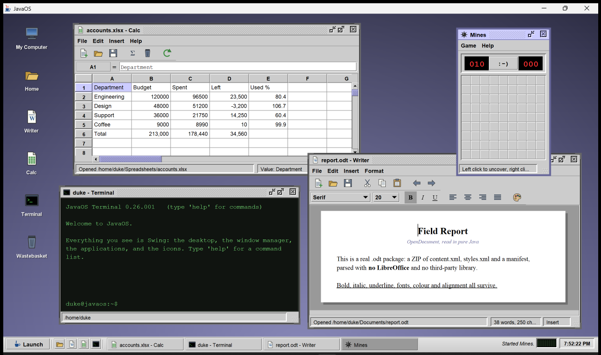

# JavaOS

A desktop environment written entirely in Swing, in the house style of Sun's own
Java desktop and StarOffice/OpenOffice 1.x: Metal's Steel palette, bold Dialog
everywhere, one-pixel bevels on everything, and a Launch menu with a vertical
product stripe down its left edge.

Nothing on screen is an image file. Every icon, Duke, the wallpaper and the
splash screen are drawn in Java2D at runtime, and the Java logo is the official
vector artwork, carried as SVG path data and filled by Java2D like the rest.

**Version 0.26.001.** The number lives in one place,
[`Version.java`](src/javaos/Version.java); everything that displays it reads it
from there.



## Running it

Requires a JDK 17 or newer (developed against JDK 25). No build tool, no
dependencies.

```bash
./run.sh
```

```powershell
.\run.ps1
```

Or build a runnable jar:

```bash
./build.sh
```

```powershell
.\build.ps1
```

```bash
java -jar javaos.jar
```

Options: `--no-splash`, `--theme steel|emerald|ochre|slate`.

## What is included

| Application | What it does |
| --- | --- |
| **Writer** | Styled text with a function bar and a format bar, a page on a grey desk, undo/redo, font and colour control. Opens and saves **`.odt` and `.docx`**, plus `.rtf` and plain text. |
| **Calc** | 26 × 200 grid with a name box and formula bar. `=A1+B2*2`, `=SUM(A1:A10)`, `AVG`, `MIN`, `MAX`, `COUNT`, `PRODUCT`, `ROUND`, `ABS`, `SQRT`, `PI()`, `^` and parentheses. Circular references report `#CIRC!`. Opens and saves **`.ods` and `.xlsx`**, plus CSV. |
| **File Manager** | Folder tree, icon and details views, location bar, back/forward history, rename, duplicate, delete, properties. |
| **Terminal** | The host's own PowerShell, running as a persistent session — pipelines, modules, `git`, your profile's aliases, everything. `cd` and variables carry from one command to the next. Six commands are answered by the window instead: `clear`, `exit`, `javaos`, `apps`, `launch`, `edit`. Up/Down recalls history, Ctrl+L clears, Ctrl+C stops a running command, and a leading `\` forces a line through to the shell. |
| **Paint** | Pencil, line, rectangle, ellipse, flood fill and eraser, sixteen-colour palette, undo. Saves PNG. |
| **Media Player** | A playlist, a lit display and a live meter. Plays **`.wav`, `.au`, `.aiff` and MIDI** in pure Java; hands everything else to VLC. |
| **Calculator** | Four functions, memory keys, `sqrt`, `1/x`, `%`, keyboard entry, LCD-green display. |
| **System Monitor** | Real machine readings: processor load with a scrolling graph and a bar per logical core, physical memory used against installed, swap, video memory, and an inventory of the installed hardware -- CPU, GPU, memory modules, disks, board. Plus the JVM heap graph, live thread table and system properties. |
| **Mines** | Beginner, intermediate and expert, LED counters and a smiley reset button. |
| **Control Panel** | Colour scheme with a live preview, backdrop style, clock format, window drag mode, user name. Changes apply to every open window at once. |

## Office formats

JavaOS reads and writes OpenDocument and Office Open XML itself, in pure Java on
top of the JDK. There is no LibreOffice dependency, no Apache POI, no ODF
Toolkit — nothing outside `java.util.zip` and the JDK's XML parser.

| Format | Read | Write | Carried across |
| --- | --- | --- | --- |
| `.odt` OpenDocument Text | yes | yes | bold, italic, underline, font, size, colour, paragraph alignment |
| `.docx` Word | yes | yes | the same, plus tabs and line breaks |
| `.ods` OpenDocument Spreadsheet | yes | yes | text, numbers, **formulas**, cached results |
| `.xlsx` Excel | yes | yes | the same, including shared and inline strings |

Formulas survive the trip in both directions. `=SUM(D2:D4)` written to a `.ods`
becomes `of:=SUM([.D2:.D4])` in the file and comes back as `=SUM(D2:D4)`;
through `.xlsx` it stays in A1 notation. The last computed value is written
alongside each formula, so a spreadsheet shows the right numbers the moment it
is opened, before anything recalculates.

Both families are ZIP archives of XML, so the whole engine rests on two small
primitives: [`Zip`](src/javaos/office/Zip.java) for the container and
[`Xml`](src/javaos/office/Xml.java) for the parts. The reader disables DTDs and
external entities — office files arrive from elsewhere, and one that quietly
resolves external entities is a way to read files it was never given.

**Not supported:** the pre-2007 binary formats (`.doc`, `.xls`, `.ppt`),
presentations and drawings, images, tables, embedded objects, and page layout
beyond alignment. Files JavaOS cannot read are handed to LibreOffice if it is
installed.

### LibreOffice

JavaOS never bundles, installs or updates LibreOffice. If you have installed it
yourself, JavaOS finds it — the Windows registry, the usual Unix paths, or
`-Djavaos.soffice=<path>` — and adds **Open in LibreOffice** to Writer, Calc and
the File Manager's context menu. Volume files are handed over by their real
path, so LibreOffice edits and saves them in place, right back into
`/home/duke`.

## Media

The Media Player sounds what the JDK can decode, and nothing beyond it.

| Format | Played by | How |
| --- | --- | --- |
| `.wav`, `.au`, `.aiff` | JavaOS | PCM pushed at a `SourceDataLine`, decoded by `javax.sound.sampled` |
| `.mid`, `.rmi`, `.kar` | JavaOS | the JDK's own software synthesiser, through `javax.sound.midi` |
| everything else | VLC | handed over, if you have installed it |

That line is not a design choice, it is where the JDK stops. WAV and AIFF are
containers of uncompressed samples, so playing one is arithmetic; MP3, AAC,
Vorbis, H.264 and the rest are codecs, and the JDK ships none of them. JavaOS
writes its own office formats because ODF and OOXML are ZIP archives of XML,
which is a weekend. A video codec is not a weekend, and a Swing desktop that
claimed otherwise would be lying to you.

The display is fed by whichever engine is running, and neither meter is
decoration: sampled audio is metered from the same buffer on its way to the
sound card, and the sixteen MIDI bars are the sixteen channels, driven by a
`Receiver` sitting between the sequencer and the synthesiser watching real
note-on velocities go past.

First boot seeds `/home/duke/Music/chime.mid`, generated by
[`Chime`](src/javaos/media/Chime.java) rather than carried as bytes — the same
rule that keeps every icon a vector.

### VLC

JavaOS never bundles, installs or updates VLC. If you have installed it
yourself, JavaOS finds it — the Windows registry, the usual Unix paths, or
`-Djavaos.vlc=<path>` — and then **Open in VLC** appears in the Media Player and
the File Manager's context menu, **Send Playlist to VLC** hands the whole queue
over at once, and double-clicking an `.mp4` on the desktop opens it in VLC
directly. Without VLC installed, that same `.mp4` opens the Media Player, which
says what the file is and why it cannot play it.

There is no `libvlc` binding here, and no JNA. The handover is a process and a
file path, exactly like the LibreOffice arrangement above.

## Around the desktop

- **Launch menu** — applications by category, a Documents submenu listing the
  home folder, Lock Screen and Shut Down.
- **Taskbar** — quick-launch buttons, one button per window, a system message
  area, CPU and RAM meters (click either for the System Monitor) and a clock.
- **Desktop** — draggable shortcuts, and a right-click menu with Arrange
  Windows, Minimise All and Change Backdrop.
- **Windows** — snap to the desktop edges, and cannot be dragged off the top.
- **Lock screen** — seals the session behind the frame's glass pane: windows
  keep running, nothing underneath can be clicked or focused, the desktop's own
  shortcuts stand down and even the frame's close button is refused. A
  passphrase is optional and set in the Control Panel; the settings file stores
  a salt and a PBKDF2 derivation, never the passphrase itself. Without one the
  screen is a privacy sheet that any key opens.

Keyboard: `Ctrl+Alt+T` opens a terminal, `Ctrl+Esc` opens the Launch menu,
`Ctrl+Alt+D` minimises everything, `Ctrl+Alt+L` locks the screen, `F1` shows
the About box.

## Checks

```bash
./test.sh
```

```powershell
.\test.ps1
```

No test framework — plain main methods that print one line per assertion.
`CoreTest` covers the formula evaluator, the file system, the backdrops, the
office hand-over order and the media split — it generates a one-second tone,
reads it back through the sampled engine, and checks the generated chime parses
as a real MIDI file. The file-system checks run inside a temporary directory,
because there is no sandbox left to contain them. The part that opens an audio
device skips itself on a machine with no sound output. `OfficeInteropTest`
writes each office format, has **real LibreOffice** convert it to the other
family, and reads LibreOffice's output back, which checks the reader and the
writer against an implementation neither of them controls. The interop half
skips itself when LibreOffice is not installed.

## The file system

JavaOS works on the host machine's own files. There is no volume, no sandbox and
no seeded tree: **My Computer** opens at the drives, and everything below them is
the real thing, read and written in place.

What survives from the sandbox is the path vocabulary. Applications speak in
forward-slashed absolute strings, and `vfs/Vfs.java` translates. On Windows the
drive is the first segment and `/` is My Computer, a directory that exists only
in that vocabulary:

```
/C:/Users/duke/notes.txt   ->  C:\Users\duke\notes.txt
/                          ->  My Computer, listing the drives
```

On Unix the mapping is the identity. `~` and `Vfs.HOME` follow the real
`user.home`.

Two things follow from dropping the sandbox, and both are deliberate:

- **Nothing is confined.** Anything the user account can reach, JavaOS can
  reach. It runs with exactly the permissions of whoever started it.
- **Deleting destroys real work.** `Vfs.delete` therefore asks the platform to
  move the file to the Recycle Bin or Trash first, and only unlinks where no
  wastebasket is offered — a headless run, or a desktop without the integration.
  The File Manager says which of the two is about to happen before it does it.

An unreadable directory lists as empty rather than throwing. On a real machine
that is an ordinary event, not a fault.

Only preferences are still kept aside:

```
~/.javaos/settings.properties
```

## Layout

```
src/javaos/
  Boot.java              entry point, command line, splash sequencing
  Version.java           the product version, in one place
  Settings.java          preferences, persisted as a properties file
  ui/                    SunTheme (Metal flavours), Ui (bevels, gradients),
                         Icons (every icon, vector), JavaArt (Duke),
                         JavaLogo and Svg (the Java logo, from path data),
                         SplashScreen
  office/                the pure-Java office engine: Zip and Xml primitives,
                         TextDocument and SheetDocument models, Odf and Ooxml
                         handlers, OfficeFormats to dispatch by extension
  media/                 the pure-Java playback engine: Media (which formats go
                         where), SampledPlayer (PCM at a SourceDataLine),
                         MidiPlayer (the JDK synthesiser), Chime (the seeded
                         file, generated)
  soffice/LibreOffice    finds an installed LibreOffice and hands files to it
  vlc/Vlc                finds an installed VLC and hands media to it
  Passphrase.java        salt and PBKDF2 for the lock screen
  vfs/Vfs.java           the host file system, in JavaOS path vocabulary
  sys/                   Machine (what the desktop knows about the hardware),
                         Probe and the per-platform probes that answer the
                         expensive questions: WindowsProbe (PowerShell/CIM),
                         LinuxProbe (/proc and /sys)
  desktop/               JavaOsDesktop (the session), DesktopPane (wallpaper),
                         Taskbar, LaunchMenu, LockScreen, DesktopIcon,
                         SnappingDesktopManager,
                         Shell (what applications may ask of the desktop)
  apps/                  App + Apps (the installed list), AppWindow (window base),
                         VfsChooser (the system file dialog), and one class per
                         application
```

Adding an application means writing an `AppWindow` subclass and adding one line
to `Apps.installed()`; the Launch menu, taskbar and file associations pick it up
from there.
